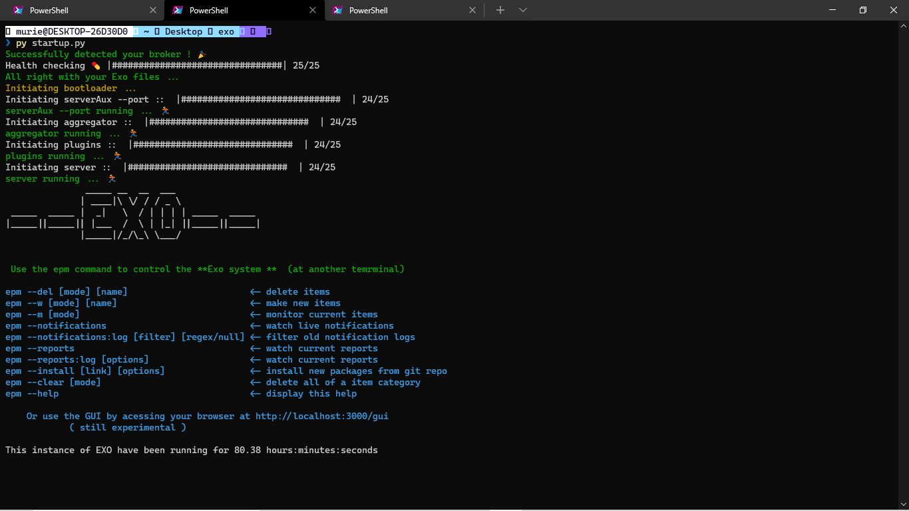
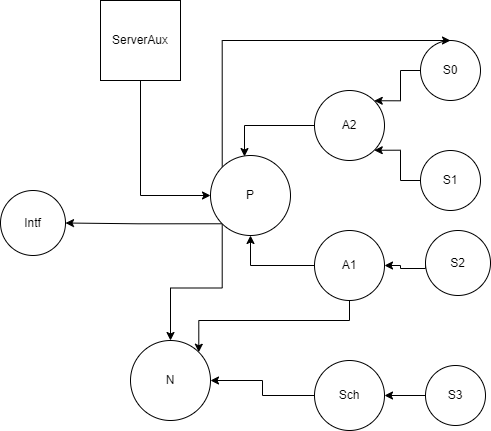
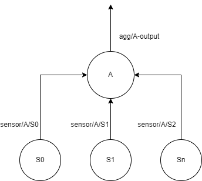
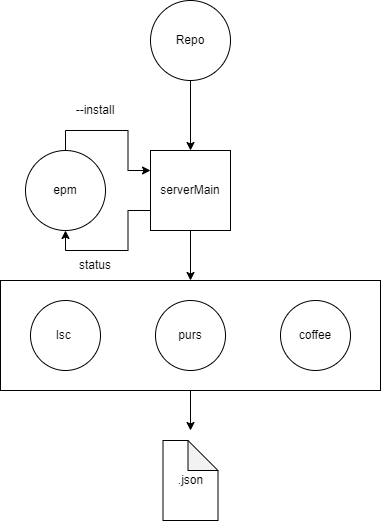
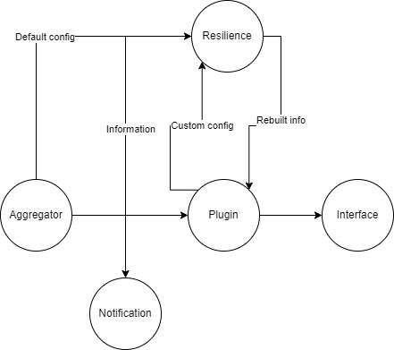

# EXO OS documentation 


### version 0.1

2022

## :: Exo System Official documentation ::


### Index 

- Getting Started
- Theory
	- Philosophy   
	- Introduction  
	- Actor oriented programming 
	- Concurrency 
	- Architecture 
- Aggregators
	- Introduction
	- Tutorial 
- Plugins 
	- Introduction
	- Tutorial 
- Schedulers 
	- Introduction
	- Tutorial
- Resilience 
	- Introduction 
	- Functionalities
- Packages 
	- Introduction
	- Tutorial 

Version :: 0.1 

# Getting Started ! 

### Downloading :: 

You can compile the source code yourself ( if you want to contribute with code ) or 
you can download the precompiled version for your platform 

* [Windows] 
* [Linux]  

### Compiling :: 

To compile the Exo yourself you must have the following dependencies installed 

*  (stack and ghc)
* 
* 
* 

and then you can run , in the Exo's folder **./exo** :

```ps
perl compile.pl 
```

Before starting an Exo instance we need to make sure Exo will be able to connect with your broker. Some http ports
must be free as well. The configuration file called **configAddress.json** is defined in the **./exo** directory.
And defines all the needed ports. By default : 


```json 
{
	"serverAux --port":{
		"port":"3030",
		"dir":"./plugins"
	},
	"aggregator":{
		"port":"localhost:1883",
		"dir":"./aggregator"
	},
	"plugins":{
		"port":"localhost:1883",
		"dir":"./plugins"
	},
	"server":{
		"port":"3000",
		"dir":"./exo-server"
	}
}
```

if you'd like to change the MQTT broker for example or if some of your ports are busy 
all you have to do is changing the configuration file and restarting the exo instance


Coming back to Exo itself, it may take a while , but if it did not fail you must be able to successfully run :
```ps
startup
```

and you may see : 



## First Steps 

The first steps to start using Exo is to know your CLI , your best friend : epm. Epm stands for Exo Package Menager, but
it's much more than only it : it's a whole interface system that allows users to manipulate the internal files and 
make changes and monitoring. 

After you startup the system , you can run, in another terminal instance, the command :

```ps
epm --help
```

and see all the current options : 

```
epm --del [mode] [name]                       <- delete items 
epm --w [mode] [name]                         <- make new items 
epm --m [mode]                                <- monitor current items 
epm --notifications                           <- watch live notifications 
epm --notifications:regex [regex]             <- watch current notifications with regex filter 
epm --reports                                 <- watch current reports
epm --reports:regex [filter] [options]        <- watch current reports with regex filter
epm --install [link] [options]                <- install new packages from git repo 
epm --clear [mode]                            <- delete all of a item category 
epm --help                                    <- display this help 

```

In this first tutorial we'll focus on a specific one : **--notifications** and **--notifications:regex [regex]** 
( The other ones will be used as needed in other tutorials ). So, with this command we can watch the topic called
"notifications". This is a special topic because all special behaviors that occurs in the system as a whole will be
published here. For example : when new sensor arrives, new aggregator or plugin is connected. When something goes 
wrong like : a sensor starts behaving unproperly or a plugin or aggregator is disconnected. To use that function you 
just need to do in a terminal : 

```ps
epm --notifications
```

and if you want to filter specific notifications you can use a regex pattern to do it using (example): 

```ps
epm --notifications:regex "[a-z]{0,10}[0-9]"
```

with this you'll be able to watch the system's current health and so on. 


## Using Exo 

To get the best ux with Exo it's strongly recommended reading the tutorials and theorical docs. There you
will find all the resources needed to understand the architecture and basic usage of the system. The tutorials have
an specific order which they were thought to be read. 

* Theory doc 
* Aggregator doc
* Plugins doc
* Schedulers doc
* Resilience doc
* Packages doc 

Those docs includes mock examples and some of the findings of our own experiments with our own applications. If you 
use Exo in some case we encourage you to contribute , specially with documentation ! 


# Our purpose 

The Exo system is not made to be **the best, ready to production** OS to MQTT but rather a scientific experiment. 
Here we want to stabilish some concepts that we think are great to advance the world of MQTT and IOT as whole. 
As the linux world did years and years ago, disrupting the ideia of a open source OS we want to do here for IOT. 
Not really defining that THIS system will be used by everybody from now but that the philosophy embody here will 
serve as a kernel to the future of new OS systems based on it. 

## Current attributes 

The current Exo system is based on a research in agricultural sensors, and the bottom-up architecture strcuture is 
based on the problems derived out of this specific spectrum of problems derived from the agricultural sensors integration
which means that it does not mean the Exo will perfectly fit all other IOT world's problem. Altough, as sais by DHH 
once the good frameworks are extracted out of real constrained applications. As ruby on rails emerged from a chat 
app the same is Exo emerging from a agricultural-driven IOT system and then expanding. 

## Our Objectives 

The objectives aimed with this system is to persue a better flexibility and usability while programming data 
processing pipelines in IOT world , wih a safe and stright forward system. It's being years since IOT is a real 
thing in the market but no solution like that have ever been done and now we have the opportunity to jump into it 
and try to start a new line of IOT OS that may help all developers that would like to contribute to the IOT world. 
From the foundations we can stabilish that the main objectives are : 

	* Flexibility
	* Usability 
	* Openess 
	* Resilience 
	* Reproducibility

### Flexibility

Our systems aims to be used in different contexts and plataforms and operates similarly in all of them. In the IOT
world we still have lots of close softwares that do not fit the rest of ohters ecosystem. Exo, altough, is very 
easy to install and use in any platform and we imagine that this must be a axiom in the current IOT world. 

### Usability 

In the Exo system's internal system, the boring parts are abstracted so that the user don't need to deal with 
the bad part of stablishing topics and routes and all blablabla. The user can, with two clicks, makes a whole
system works perfectly without the need to touch any code using the GUI and the package's links. That's another point
that a lot of IOT world lacks of, and that we want to bring back.

### Openess

Deriving from the MQTT philosophy of publicity , we designed our system in a way that all information is avaible 
for any agent connected so that everything can inspected, read and processed freely. That's good because lots of 
other OS do not allow the access of certain raw information, or at least made very difficult to find and inspect them.


### Resilience 

That attribute come directly from the Erlang's , and more recently Elixir's, philosophy of a VM with various fail 
tolerant systems. The case with Erlang as very similar to our IOT one : a crash on one point must not compromise the 
rest of the system. That's the case here , to that we use the two technics : AI and functional programming. 
Using Haskell as the foundation of the system we can garanty a safe source code. And using the resilience AI cluster
we can make sure some of the data won't be lost the our system will keep running even if it's little injured.


### Reproducibility

Last but not least the reproducibility. Here we return to the packages. That's because other reactive system like ROS
makes it very difficult to install specific packages and drivers for each new component ( because dealing with robots 
is more complex) but do not makes it impossible. In our system the packages are very easy to install and very flexibly 
in terms of languages and usability. The reproducibility is done as easy as it seems given we're using well stabilished 
tools like git, github and json. 


## Finals thoughts

As said before this system is a just a beggining foundation of a hidden philosophy that it embodies. We strongly hope new systems
will emerge out of this one and shiny even more fitting different problems using different tools and architectures. By now we will
keep improving our researches. 

Keep an eye on it ! 


# Introduction 

## Why Exo's name ?

Exo stands for "Exoskeleton" a analogy of how the architecture works inline with the MQTT protocol. 

## What's Exo ? 

The Exo system is thought to be a superficial operating system that works on the top of MQTT protocol and organizes 
all the boring and repetitive work so that the user only need to worry about it's own criativity ! 
Exo was heavly inspired by other systems such as Erlang VM , ROS and JRuby. All those systems have something 
in common : abstraction layers , such a way that the user can deal with really complex stuff while still 
keeping the language simple and the cognitive overload as low as possible. 


## What about it's DNA ? Haskell 

Exo has a functional DNA. Most of the system is written in Haskell. A purely functional language with a compile time 
type checking system. Altought some of the system is written in another languages, but we mainly choosed Haskell to make 
most of it because we need a safe compiled language to make sure that the data that flows through the 
system wouldn't be affected by undesired side-effects. Haskell is a very performatic language as well and it's runtime
can deal very well with green threads and given we use lots of threads in Exo system that just fits well ! 
The other languages here are used to peripherical structures that Haskell wouldn't perform very well : 

* perl  		: file handling and transpilation  
* python 		: startup file , to boot the system 
* livescript    : run the plugin's scripts 

If you don't know Haskell, we encourage you to try learning it because the Exo's code isn't much idiomatic 
and even a begginer can understand it properly ! 


## Who can use Exo? 

As the same Ruby on Rails did in the begging of the century , our system aims to facilitate the usage of the mqtt protocol 
so it can be used by anyone intrested in IOT development. All the abstraction layers and default options must be enough to 
begin with a full performance development. 
Common users must be able to use Exo as well, given that the package system and the gui will make the user feel like using any 
other OS ! 


## Where does Exo should go ? 

We strongly recommend you to install Exo system in a powerfull server if you're going to use thousands of sensors and plugins
but for small projects and tests any pc will work. The system is smart enough ( thanks to Haskell ) to keep it thread safe and 
will not push your machine to the limit by default. 
The modules will all be started by a single file ( it's plug and play ) and they must be kept as it come so that the binaries. 
and executables won't be messed up.In the future section we will discuss about the future prospects of Exo's architecture modularity 
and there may be good news in the future 
about the module's decentralization, so that this current paragraph may change (keep an eye on it !). 


# Exo: the movie,starring actor oriented programming 


## What's on earth is "Actor oriented programming " (AOP) ? 


Here the magic begins ! The foundation rock of the exo system is the so-called "Actor oriented programming" which is a programming
paradigm that have it's roots in the late 70's with the researchs by the Erlang creators in Ericsson labs. 
This programming paradigm was basically made to deal with multiple threads performing very different tasks and their communication
system. Lots of languages have libraries to deal with actor based system but Haskell does not have any decent and maintained one. 
In exo system we used programming patterns to deal with those actors and by now we haven't extracted the library out of it yet. 
Here you'll find that each module have a similar strcuture that follows the principles of AOP. 


## Ok, but how does that work ? 

The current paradigm have no official stablished foundations and each author applies the abstract concepts to it's own interpretation
and programming language specificities. In this case we use a pattern here named "Supervisor-Actor". 
The following definitions are applied : 

* Supervisor 
	* It's a main thread a module, it's keeping observing and reacting to specific tasks , most of them are IO operations 
	such as file changes, and for each change there's basically 2 operations : IO or spawning. 
	In Exo , the supervisor does not have the power to kill child threads only to spawn them. So while the supervisor is 
	watching a file it can see if the there's a need to spawn new threads or make some IO operation.
* Actor
	* The actors are independent threads spawned by the supervisor that have it's own life cycle. The actor can perform 2 actions
	as well : IO or killing. The Actor's divison is 2 too : head and body. The head is the part of the thread that keeps watching 
	an specific file and waits for changes, the body is the the part that is always processing data. If a changes occurs in the file
	the head will react and will choose to kill it's own or to keep processing data. 

Example : 
	Let's say we have **file1.json** and we'll use AOP architecture to perform an action on it : 
file1.txt has : 
```json
{ "a":[1] } 
```
Our supervisor will watch it and create an actor that prints the number 1:
```
1
1
...
``` 
But when we change the file to :
```json
{ "a":[1,2] } 
```
then : 
```
1
2
1
2 
...
```

Now the supervisor will create a new thread that prints the number 2. What if we do :

```json
{ "a":[1] } 
```	

Now the "number 1 thread" will check this file and understand that it's been deleted so we now will only see : 

```
1
1
1 
...
```

This general architecture is found in all four foundation modules : plugins, aggregators , schedulers and Resilience.
In all those modules the flexibility of AOP is shown by the fact that supervisors may spawn new actors and the actors may kill
shut down themselves based on IO operations controlled by configuration files. If those files changes they can rapidly change their 
states and starts processing data in a different way !
This was a introductions to this concept, it's alright if you didn't get it at first the next pags and chapters will come back to 
this frequently and you may understand it better.


# File partition : not as distributed as in soviet union 


## Green threads and config files

Everything in the world is now green, so does threads ! ( always helping the little animals ). The concept of green threads is to
use real processor threds but divided in such a way that it will not push your hardware to it's bad parts. Haskell's runtime will 
use green threads after compiling the files so there should not be thousands of memory leak. 
While using threads it's easy to get brainfuc**ed giving it's natural async nature. In Exo, though, there's another layer of 
complexity given we have lots of configurations files that must be checked and rechecked to make sure nothing is out of control. 
To avoid letting things got wrong lots of times, the IO system in current Exo system is based on streams and lazy evaluation. 


## More names and file blablabla ... 

I'll be direct with you : 
	
* Lazy evaluation 
	* It's the concept of using only the needed part of something, take lists for example : [1...10] in Haskell this is lazy evaluated
	because the memory need to store the list will only be used if the compiler understands that all the numbers will be used, if not 
	it'll be only a potential memory usage. So the same occur with our files, as soon as the actor and supervisor finds a difference 
	they will act without the need to read will the file before ( when possible of course not all cases uses it )

* Streams 
	* Instead of opening, reading and closing a file ( which can lead to deadlock problems ) , we sometimes use streams which is the 
	concept of letting an file opened and keep writing on it. That's specially good when dealing with files that will only be 
	accessed by a single thread and no one more. It's not possible to do it in all cases but it's good for you to know that dumb ! 

Using those concepts allied with green threads we can avoid deadocks, stack overflow and memory leak. This does not mean, though, that
those kind of things do not occur at all those pratices makes them more rare, and by tests we could affair that when some deadlock
occurs usually the thread can try acess in some seconds again and the problem is gone (altough that solution is not the best yet). 


# Exo Modules-Architecture

## Let's talk about executables ... 

The exo system itself is made out of some executables that perform tasks in their specific directories ( 
your Genius author ! now tell me that the sky is blue ...).
To be more specific , those are the following executables and their directories :

	* Aggregator in exo/aggregatotr	
	* PLugins in exo/plugins
	* serverAux in exo/plugins
	* Schedulers in exo/schedulers
	* Resilience in exo/resilience 
	* Server in exo/exo-server
	* Epm in exo/exo-cli	

and the startup.exe in the upper directory of exo which is not considered a foundation module. 
All those executables are installed by Exo and will be spawned when the startup file tells it to . 
Each of them perform a task whithin the OS using the system's configurations files. 
The **Aggregator**, **Plugins** and **Schedulers** are the most important ones and they're the ones 
that makes most part of the information's flow control. **Resilience** is the AI module, which is basically
an experiment and makes this module very beta yet. Athough it's very important for the current purpose of 
the experiments that will be shown here. **serverAux** is a parallel http server to make js plugins execution 
faster and more direct. The scripts will be executed outside the main process which allows for more safety and
speed. The **Server** and **Epm** modules talks to each other directly. The first one creates an http interface 
to the second to access the internal configuration files, so that fundamental changes can be done without compromising 
the integrity of those files given that the access is controlled by that interface. 
The following diagram may give you a a spacial sense of how all those modules communicate with each other





in this scheme : 
* Sensors : S
* Aggregators : A 
* Plugins : P
* serverAux is the js interpreter 
* Schedulers : Sch
* Intf : Interface , where goes the reports 
We'll be diving deeper into those specific schemes when getting into specific chapters of each
module, by now you can see that everything is interconnected and everything has a reason !	
That's all ! All the theory went out now, we hope you could understand the basics of Exo OS and now you're able 
to pass to another directories and watch the specificities about the foundation modules functionalities. 


# Introduction to Aggregators 

## What's an aggregator ? What does that aggregates ? I need answers, now ! 

So, the Exo OS is thought to be a down-top approach to solving IOT problems. To do that we need abstraction layers
between the iot hardware components and our software processing units. The first layer of abstraction here is 
the **Aggregator**. 
As the name suggests the aggregator joins informations from the sensors into a specific data structure. 
In the exo system the aggregator will make use the MQTT topic's patterns to specifiy the sensors you want to listen
to. An aggregator configuration file is basically as following : 

```json
{ "name_agg":"A","route":"B" }
```

This json describes a aggregator of name **A** that listen to **B**. Here, though, the listening occurs slightly 
differently from direct communcation because we need flexibility, so the listening occurs on a range of ports 
delimited by the following pattern : "sensor/B/X" where B is the current route attribute and X is the generic 
sensor name you'd like to use. In this case we case we can see some well-formed sensor's topics as the following : 

```
sensor/B/moisture-1 
sensor/B/moisture-2
sensor/B/temperature
``` 

With this done, your aggregator is able to generate a well formed data structure known as GenericAggregator as following

```json
{
	"name_agg":"A",
	"current_data":[
		["sensor/B/moisture-1",1],
		["sensor/B/moisture-2",2]
	]

}
```

This data structure is very simple but powerfull enough to export all the information that need to be processed by 
our post-processing plugins. We have the current aggregator name and the sensor's it has been listening to recently. 
A good part is that given we're using a pattern to define our listening topic there're no limits to the amount of 
sensors that can be connected to the aggregator nor specific ones. For example, if we suddenly starts publishing  
a new information on the topic **sensor/B/temperature-2** the aggregator will recognize it and just add this to the
generic output structure:

```json
{
	"name_agg":"A",
	"current_data":[
		["sensor/B/moisture-1",1],
		["sensor/B/moisture-2",2],
		["sensor/B/temperature-2",3]
	]

}
```

and the aggregator is good wiht it, no problems at all. As seen before in the general theory documentation, this is 
a configuration modification automatically done by the system so a notification will be published in the **notification**
topic as the following : "[New sensor sensor/B/temperature-2 at time T]" ( with the time T being the current date). 
It's good to point that aggregators will always publish the result information from the processing and concatenation 7
of the sensor's information in a specific topic pattern the same as **agg/B-output**. 
If you're a visual person, the following scheme maybe be clarifying to you : 



# How to : Aggregators

In this tutorial we'll be seen how to configurate an single aggregator and how it works
in a daily workflow 

# How to start ? 

Everything always starts by using the epm interface, by now we'll be using the command line
interface but soon there'll be a GUI tutorial as well. 
The command to create an aggregator ( after you started your Exo instance ) is :

```ps
epm --w aggregator [name] [route]
```

With that command we can create a single aggregator with the given attriutes .
To begin, we can start by a mock example with the following characteristics :

```ps
epm --w aggregator cluster1 test
```

So as we know by the theorical introduction, this aggregator will listen to the port **sensor/test/#**.
and that's it , our aggregator is already done and runnning ! 

# What if i want to ...

* Delete an aggregator ? 

You just need to :

```ps
epm --del aggregator cluster1 
```

* See the current aggregators ? 

```ps
epm --m aggregator 
```

* Delete them all ? 

```ps
epm --clear aggregator 
```


# Introduction to the heart of all of this : plugins !


## What are plugins ? What do they eat ? Where they live ? 

So the bigger star of the show is the **plugins**, they're made to process the information from the aggregators
and make them useful and influence and the rest to system's hardware. 
Plugins are basically little programs made to process the data, with some specificalities that will help the user
to process data using libraries made to it. The plugins can be written in any language that compiles to javascript
and we recommend : livescript and purescript. Those are two languages that fit the rest of the Exo's philosophy of
functional programming and have the best match for our data-oriented library. 

## Anatomy of a plugin 

The plugins have the following data structure to be configured : 

```json

{
	"name":"moduleX",
	"agg_route":["A","B"],
	"script_path":"test_X"
}

```

The "agg_route" attribute describes the aggregators the plugins will listen to. In the same way the aggregators
are responsible for organizing the information that comes from multiple sensors, we can think that plugins are responsable
for processing and organizing the information that comes from multiple aggreagators. In this case the aggregators 
being listened to are **A** and **B** , and the plugin is names **test_X**. 


## Processing information 

So, how does the information is actually processed ? The information that is generated , and that goes as input to the 
plugin, is storage by the auxiliary server as a global variable called INPT and it's a list of aggregators output. In 
the current case we can imagine a INPT information like the following : 

```json 
[
	{"name_agg":"B","current_data":[
		["sensor/B/moisture-1",1]
	]},
	{"name_agg":"A","current_data":[
		["sensor/A/moisture-2",1]
	]}
]
```

So that's the general structure one must have in mind while coding a plugin. Inside the plugin itself, we can access
the information as any other global variable. 
The plugin is run everytime a new sensor publishes a new information, which means one code the plugins as a single 
data processing pipeline without infinity loops or very time consuming requests, otherwise that will block the Exo
system. 
To help the information export and processing we have a library called **plumbing** which will help the user to define
functions processing pipelines and chaining. To evoke the end of the plugin execution we have a special function called
**EXPORT** and to publish a value on a topic we can use **CLIENT** ( which is the auxiliar server's client already 
connected to the broker, so no need to connect it). The following is an example of a basic plugin written in livescript.

```ls
main = do 
	"turn-on" |> CLIENT.publish "light"
	INPT	  |> EXPORT 
```

This is a simple example, where we publish a string called "turn-on" in the topic "light" and then export the 
input information without any transformation. The CLIENT function is useful when you need to give orders to hardware 
that is connected to the broker and listening to specific topics. 

The system also exposes a data-oriented library called "plumbing" that helps the user in writing expressive
pipelines of data processing with much less pain ! Some of it's functions includes :

* FilterSensorData : extracts only the pure numerical information from aggreagtors
* Report : create a report to output well formated data out of the plugin 
* PatternPipe : run and compile a list of results from a list of functions for a single value 

The list of functions will get bigger, but it's important to use such a library so that manipulating
the input information get easier and faster. The inclusion of that library is **implicity** so no 
importing statment is needed. 

## JS pipelines 

As said before the plugins must be written a language that can compile to js. There's a trick here to help this feature
called **compilation pipelines**. Those are perl written little recipes of how to compile a specific languages to 
javascript. For example in livescript, given livescript is installed in your machine, the perl code will enter 
the plugin's specific directory and run "lsc -c X" for every .ls file and then compiling it into useful .js files. 
That can be repeated to every supported language until now which are : 

* purescript 
* livescript
* ruby 
* coffeescript
* typescript

Those pipelines will be specially useful when we deal with packages, in the **packages section**.
But never forget you **must have the compiler installed** otherwise the recipes won't find it's way through it. 
This schematic represents how the interface **epm** connects to the pipelines system and compiles everything : 



# Let's do it

To create a new plugin we just need to use our best friend epm : 

```ps
epm --w plugin [name] [script] [route]
```

In this case we can mock on up using the following instructions : 

```ps
epm --w plugin module1 test_one test
```

If you followed up the last tutorial from aggreagtors you know we created
one aggregator that will publish on the topic **agg/test-output** the joined
information from the sensors. This plugin, then, will listen to this aggregator 
using a file called **test_one**. In this case we will manually insert the plugin source
code. You just need to insert the source file in the folder **./exo/plugins/rules**. The source
code is the following :

```js

function main(){
	EXPORT(INPT);
};

main();

```
Which is a basic plugin written in JS. Save it in a .js file and put in the right directory.
**If manually putting the plugin inside rule's folder you must already compile it to JS yourself, the pipelines only work with downloaded plugins** 
Then we can see our plugin with the command :  

```ps
epm --m plugin
```

or , if you want, to delete it or delete all plugins:

```ps
epm --del plugin module1 
epm --clear plugin 
```

To test if everything is ok you can navigate to the **./examples** folder and run a script called "test.py" as the 
following example : 

```ps
py test.py localhost:1883 
```

Here we'll be using our local broker but you can use any broker you'd like to.  
If we did everyhting ok , we're able to see the plugin's results using the command : 

```ps
epm --reports 
```

If you'd to post process that data you can pass regex args and print on specific reports we can filter them by 
passing an regex pattern to match them.

```ps
epm --reports:regex [a-z]
```


# Be like water my friend 

One of the main spots of the exo system is it's resilience capababilities. This is everywhere but more specifically 
in this specific point. Imagining that this kind of system is designed to be online for days and days and rarely be 
turned off then it is good to have a tool that will help us spot problems and solve them. In this case, a problem we'll try 
to solve is the problem of damaged sensors.

# The study case  

To illustrate the problem imagine we're processing various kinds of sensors like the following mock data :  

```

a : 1
b : 2 
c : 3

```

and then the sensor **b** starts publishing a random nonsense data :


```

a : 1
b : jfskh74
c : 3

```

that probably means we have a hardware problem with the **b** sensor. If this problem have been persisting for some hours all our 
database is now compromised, to be clear : **poisoned**. Our plugins have been processing trash for a long period of time.
To solve that kind of occurence we thought in creating a system that could transform a trash data into new good data again ! 


# Clustering and Math 


Mathematically speaking we all our data that comes from the sensors are a array of float vectors. Let's continue with our last example:


```json

{
	"name_agg":"cluster1",
	"current_data":[
		["a",1],
		["b",2],
		["c",3]
	]
}

```

if we extract only the values form the sensors we'd have : 


```hs
let vec = [1,2,3]
```

The same can be done to the trash data as well 


```hs
let vec_trash = [1,jfskh74,3]
```

How to rebuild that information ? : Historical data ! Given that we've been processing data for a **T** period of time before the sensor
stopped working then we can train an IA model to recognize contextual data, like the following : 

```hs

[3,4,5]
[6,7,8]
[9,10,11]

``` 

So imagine a generic math model could be feed with that data , then our model could predict something that as **formation rule** for
our data : 


```hs
formation :: Int -> [Int]
formation x = [x,x+1,x+2]
```

and then if we now have a trash data, we'll only need the first element to predict our data : 

```hs
[1,jfskh74,3] -> [1,z,3] -> [1,2,3]
```


# Otherwise, not everything is so simple in the real world 


Of course those were mock examples. In the world we'd need at least two more things to actually discover our hidden data :

* Clustering 

In our mock example, the clustering algorithm wasnt needed because we only had few data strcutures. In real data, otherwise, various other factors
influences the information that comes into play. The current research case, and for most part of other contexts, we'll be using the time as a cluster
criteria. So all clusters will be divide depending on their current point in the day time. We'll have 24 cluster for each new model and each cluster with 
inifinite number of data.
The **k-means** algorithm we'll be using then needs to correctly identify the cluster the corrupted information belongs to, so that's our objective.


* Substitution 

After we figured out which cluster does one the information belongs to, we need to actually rebuild it. Let's see a simple mock example with the following clusters :


```

a : [0,2],[4,6] 
b : [1,3],[5,7]
c : [-1,-2],[-3,-4]

```

Here each of the letters denotes a range of time in the day. 
So lets consider a corrupted vector at period of time **a** ( the model would guess it).

```hs
let v = [4.25,x]
```

Now, how we proceed ? we need to find the formation rule, to do that. If we look and imagine the formation rule 
as : 

```hs

formation :: Int -> [Int]
formation x = [x,x+2]

```

Then the strict answer to the vector's information lack (x) is **6.5**. We cannot guess such a precise value because 
we won't be processing formational rules (because it's not needed), but vector proximity using the cos-similarity algorithm. 
After doing so we find that the closet vector will be **[4,6]** and we consider it to rebuild our trash one :


```hs
[4.25,x] 
[4,6]
``` 

and as result we substitute our **x** by **6** and we get a vector of **[4.25,6]**. In this case we got a **4.16%** of error based on our expectations, 
but it won't impact the rest of the system as whole given we've been dealing with lots and lots of data and **4.16%** of error is a good margin.


# System Integration 



To actually use **Resilience** you don't need special configurations or anything. That's because there's always an model associated to each aggregator.
If a new aggregator is added to the system, the Exo will understand it and already start collecting information and creating a database. Thre're two ways
of activating the rebuilding mode : 

* Null information

When a sensor starts publising **0** as it's value or **null** the system will atumatically starts to rebuild that information for you. So be aware to not
let any of your sensors use **0** or **null** as a accepted value. 


* Plugins 

There's a global function that can be accessed using your plugin called **REBUILD** which will rebuild one specific information send to the your IA. This 
is much easier to be used and you can make it customized for specific values that the default structures cannot predict. For example : 


```ls

test = (x) ->
	x 
	|> FilterSensorData
	|> -> if any (>1.5) x   
			then REBULD(x)
			else x

```


This simple function for example may rebuild the **x** data when any of it's members have a value smaller then **1.5 **.
It's important noticing that when the AI is called it publishes a notification in the **notification** topic warning the user about the corrupted sensor. So 
you can monitor the actions of your customized trigger function with : 

```ps
epm --reports
epm --notifications 
```


# Warnings 


All of this is very cool and integrated out of the box and manually with the system, but this kind of information rebuilding have a purpose. The same way 
we can rebuild a image out of broken camera, we do so because the camera may be fixed in the future, the same here : the sensor must be fixed. We can think
of the precision of the system as time inverse formula : 


```hs

precision d t = d/t 

```

Where **d** is your database lenght and **t** is the current time passed. Don't let the **Resilience** working forever, otherwise we'll end up having what we've been
trying to avoid : poisoned database with bad formed information. To avoid this, you can implement ( and we strongly recommend you to do so ) a redundant sensor system
where each of them have their counterparts in case of bad function and then **Resilience** must only work for a brief period of time ( some hours ) correcting small amount of errors.

# Packages - Like taking candy from baby ! 

Packges were tought to facilitate the installation and distribution of pre-configured aggregators, plugins and 
schedulers for other Exo users. This will facilitate the distribution of already made iot system by companies 
with a unique platform with simple and organized apis. 

## The structure of a pacakage 

The following structure is a json that must be your folder when creating your package : 

```json

{
	"package_name": "Package Example",
	"dependencies": [],
	"package_aggr": [
		{
			"name_agg": "A",
			"routes": "A"
		},
		{
			"name_agg": "B",
			"routes": "B"
		}
	],
	"package_plugin_config": [
		{
			"name_module": "module1",
			"agg_route": ["B","A"],
			"script_path": "test_module"
		}
	]
}
```

we have here 4 keys, in order , the name of the package , some dependencies ( to be made ) , your aggregator's definition
and your plugin's definition. As you can see it's easy because each key defines in a list all your aggregators and plugins
and that's it. In this case the plugin defined listens to the aggregators defined here **A** and **B**. And that's a 
good pratice : define the aggregators you'll use. 

In the same folder as you putted this **index.json** you must put all the source code that you defined. In this case 
**test_module**. Only use the name of the file, because if pre-processing is needed then the compiler will deal with
defining the file's extension. 

``` 

package 
	- index.json
	- test_module.ls

```

After your making your folder, you must upload it to github so that other users can clone your repo ! and that's it
for defining new redistributable packages. 


# Let's get our hands .. not dirty at all, that's very easy ! 

This will be a very easy tutorial. As said in the other tutorials, let's first run our modules : 

```ps
startup 
``` 

after you saw that nothing crashed, we go to another terminal and : 

```ps
epm --m plugin
```

let's say we say we saw a clear plugin's container , if not you clean with the command : 

```ps
epm --clear plugin
```

After that we're good to go and see the package being installed with the command : 

```ps
epm --install https://github.com/synth-me/ExoPackager livescript
```

in this case you see we passed the parameter **livescript** meaning the livescript compiler must be used 
to create a readable plugin. This may take a while, but after it all you should be able to see your reports
being logged with the command : 

```ps
epm --reports 
```

and we're good, now you know how to install packages ! 

